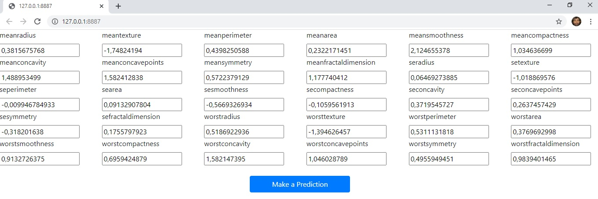
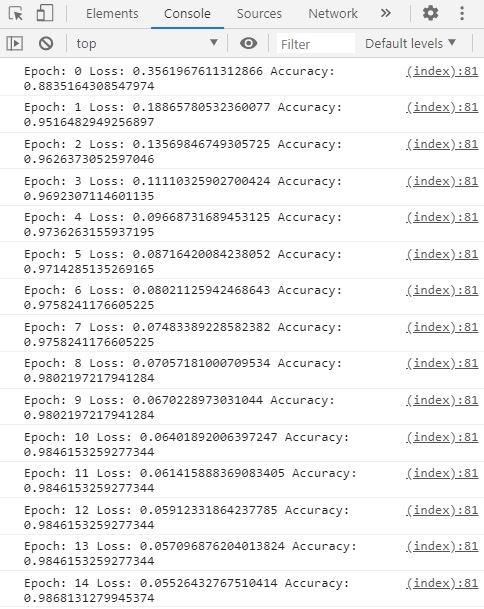

#   Breast Cancer Prediction with Machine Learning

The purpose of this system is to offer an aid to breast cancer prediction based on the [WDBC dataset](https://archive.ics.uci.edu/ml/datasets/breast+cancer+wisconsin+%28diagnostic%29).

## System Requirements

### Functional Requirements
 - Ingest a breast cancer database
 - Build a neural model for learning
 - Train this model based on the cancer dataset
 - Test the model with new data to verify learning accuracy
 - Develop a User Interface (UI) for entering data and receiving prediction
 
### Functional Requirements
 - Privacy
 - Usability

## System Design
 - [Software Architecture](https://apps.dtic.mil/dtic/tr/fulltext/u2/a288963.pdf): to achieve the required privacy for the system, a [client-server software architecture](https://robertheaton.com/2020/04/06/systems-design-for-advanced-beginners/) that is commonly used should be avoided. Patient data should not go to a server and, therefore, prediction should be made with technologies that allow inference on the client side.
 - UI Design: To achieve a good user experience (UX), the system's usability project will be based on Jakob Nielsen's [10 usability heuristics](https://www.nngroup.com/articles/ten-usability-heuristics/).

## System Implementation

For the implementation of the software architecture summarized above, [Tensorflow.js](https://www.tensorflow.org/js) technology was chosen. It allows data privacy through a software architecture that allows the construction, testing and inference of data on neural models using the client side.

For the development of the UI, the Bootstrap and Jquery libraries were used.

Below, screens of the developed system:

## System Test
The accuracy of the system, when making predictions with the test set, was 98%.

## Note

This system was developed to demonstrate how to extract predictions from datasets using Machine Learning. Everything that has been done can be applied to different areas such as transportation, education, public security, logistics and so forth...

*** This software is EXPERIMENTAL and should only be used for research purposes. Please see a doctor for any diagnostic reasons.
